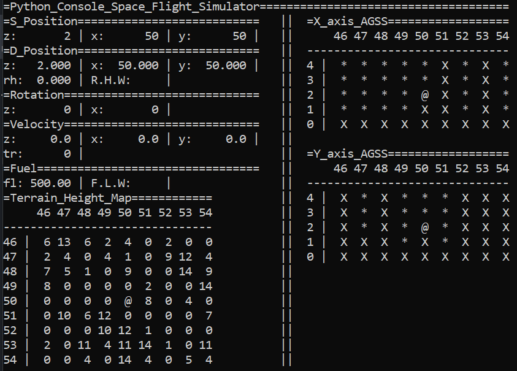
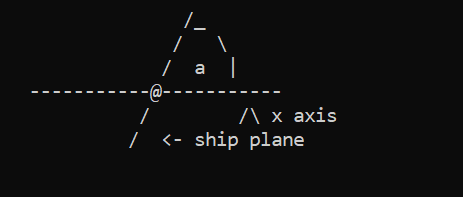
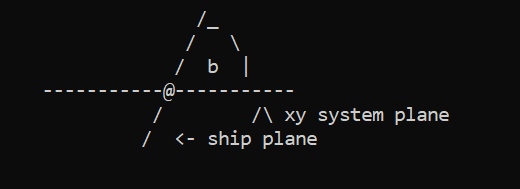
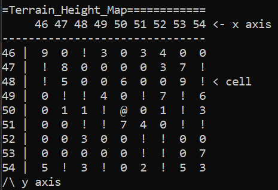
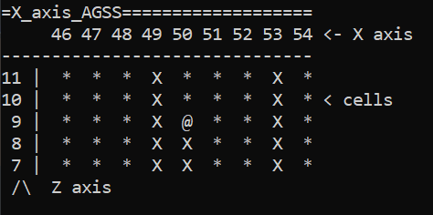
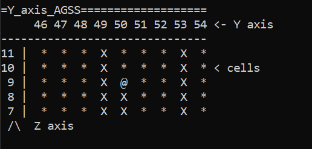
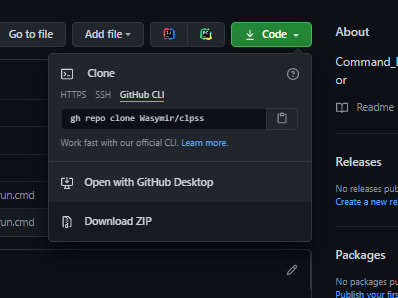

# Command_Line_Python_Space_Simulator
___
___
### Table of Contents
- [UI Explanation](https://github.com/Wasymir/clpss#ui-explanation)
- [Key Binding](https://github.com/Wasymir/clpss#key-binding)
- [Installation tutorial for non-technical people](https://github.com/Wasymir/clpss#instalation-tutorial-for-non-technical-people)
___
___
## Ui Explanation
___

___
___
### S_Position -> Simplified Position
Is used to define a simplified position on the map, useful for navigation on map.
___
| property      | Description |
| :---        |    :----:   |
| z      | z axis integreter position       | 
| x   | x axis integreter position        | 
| y   | y axis integreter position       | 
___
___
### D_Position -> Detailed Position
Is used to define a detailed position on the map, useful for determining the distance to the next map block.
___
| property      | Description |
| :---        |    :----:   |
| z      | z axis float position       | 
| x   | x axis float position        | 
| y   | y axis float position       | 
| rh   | relative height       | 
| R.H.W   | relative height warning - starts blinking if rh < 1|

___
___
### Rotation
___
Determines the slope and rotation of the ship about the axes.
___
| property      | Description |
| :---        |    :----:   |
| z      | z axis rotation (see 'a' angle at  1. picture)| 
| x   | x axis rotation (see 'b' angle at 2. picture)| 
___
1. picture

___
2. picture

___
___
### Velocity
Is used to define a movment speed at every axis and engine thrust.
___
| property      | Description |
| :---        |    :----:   |
| z      | z axis movement speed       | 
| x   | x axis movement speed        | 
| y   | y axis movement speed       | 
| tr   | engine thrust       |
___
___
### Fuel
Is used to define a fuel level.
___
| property      | Description |
| :---        |    :----:   |
| fl      | fuel level       | 
| F.L.W   | Fuel Level Warning - starts blinking if fl < 50 |
___
___
### Terain Height map
Used for navigation and determination of altitude on a given map block.
___

| map cell value      | Description |
| :---        |    :----:   |
| number      | terrain height       | 
| !   | block of the map that you can crash into        | 
| @   | your ship       | 
| #   | block outsite of map       |
___
___
### X_axis_AGSS -> X axis Advanced Graphic Surface Scanner
Used to navigate perpendicular to the x axis.
___

| map cell value      | Description |
| :---        |    :----:   |
| *      | empty map block       | 
| X   | filled map block        | 
| @   | your ship       | 
| #   | block outsite of map       |
___
___
### Y_axis_AGSS -> Y axis Advanced Graphic Surface Scanner
Used to navigate perpendicular to the y axis.
___

| map cell value      | Description |
| :---        |    :----:   |
| *      | empty map block       | 
| X   | filled map block        | 
| @   | your ship       | 
| #   | block outsite of map       |
___
___
## Key Binding
___
| key      | function |
| :---        |    :----:   |
|   w    |   Pitch up  (raises x axis rotation)   | 
|   s   |    Pitch down (decrease x axis rotation)    | 
|   a   |    Yaw left (decrease z axis rotation)   | 
|   d   |    Yaw right (raises z axis rotation)   | 
|  q    |    Thrust up  (raises thrust)  | 
|  e    |    Thrust Down (decrease thrust)   | 
|  z    |   Thrust Emargency Brake (sets thrust to 0)    | 
|  r    |  Landing Engines up (raises z axis movement velocity)     | 
|  f    |  Landing Engines down (decrease z axis movement velocity)    | 
|  g    |  quit     | 
___
___
## Instalation tutorial for non-technical people
___
1. Download zip with repository by clicking 'Code' button and then 'download zip'

   
2. Unzip downloaded file.
3. Now you can delete Read.md file and Img directory.
4. if you don't have python, install it. According to this [tutorial](https://www.youtube.com/watch?v=IDo_Gsv3KVk).
5. Install required libraries
    - Open Comand Line, if you don't know how use this [tutorial](https://www.howtogeek.com/235101/10-ways-to-open-the-command-prompt-in-windows-10/#:~:text=Press%20Windows%2BR%20to%20open,open%20an%20administrator%20Command%20Prompt.).
    - Run this command, remember to replace ().
        >pip install -r (path to requirments.txt file)
      > 
6. If you are using windows run 'run.cmd' file, but if you are using linux or Mac OS compile cpsfs to bytecodes first and then just run with python compiled file. You can do it by doing this [tutorial](https://www.geeksforgeeks.org/generate-byte-code-file-python/) and running this command, remember to replace (). 
    > python (path to complied file)
   

